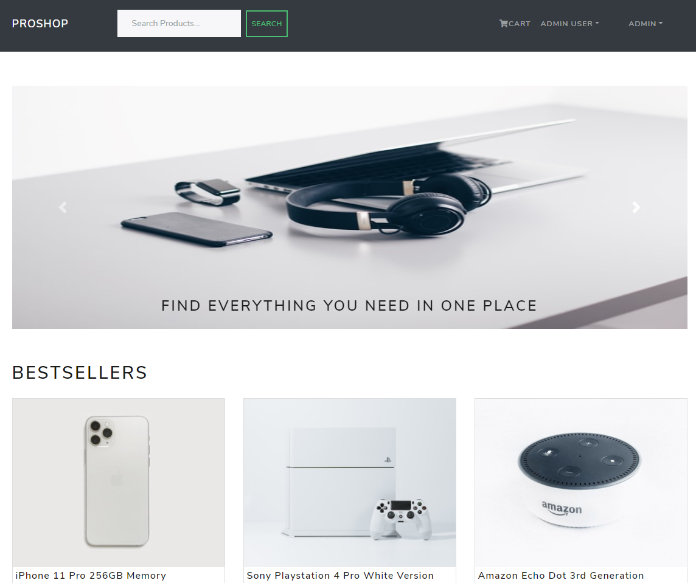

# Proshop

## Deployed site
[https://https://proshop-las.herokuapp.com/](https://https://proshop-las.herokuapp.com/)

## Public Homepage

## Features:
<ul>
<li>First item</li>
<li>Second item</li>
<li>Third item</li>
<li>Fourth item</li>
</ul>
⋅⋅*Full featured shopping cart
⋅⋅*Product reviews and ratings
⋅⋅*Top products carousel
⋅⋅*Product pagination
⋅⋅*Product search feature
⋅⋅*User profile with orders
⋅⋅*Admin product management
⋅⋅*Admin user management
⋅⋅*Admin Order details page
⋅⋅*Mark orders as delivered option
⋅⋅*Checkout process (shipping, payment method, etc)
⋅⋅*PayPal / credit card integration
⋅⋅*Database seeder (products & users)

## Technologies:
HTML, CSS, React, React Bootstrap, NodeJS, Express, MongoDB, Redux, PayPal API

## License/Disclaimer:
I followed Brad Traversy's course MERN eCommerce From Scratch on Udemy.
Copyright (c) 2020 Traversy Media
